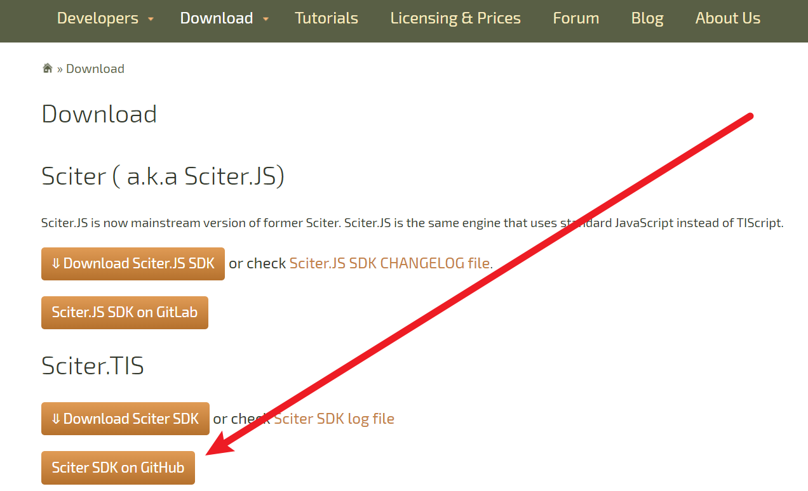
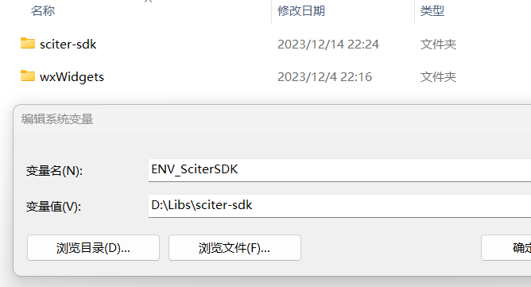
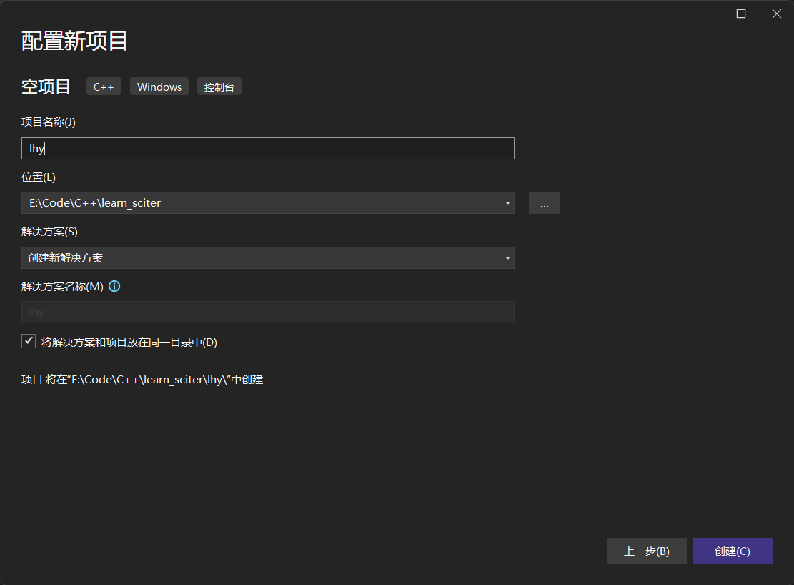
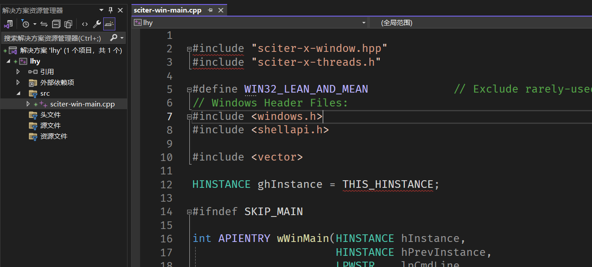
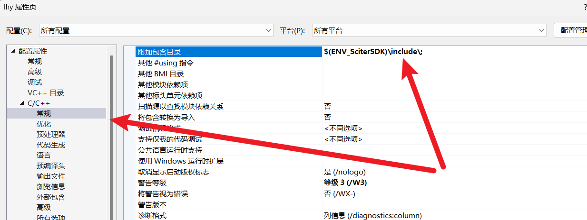
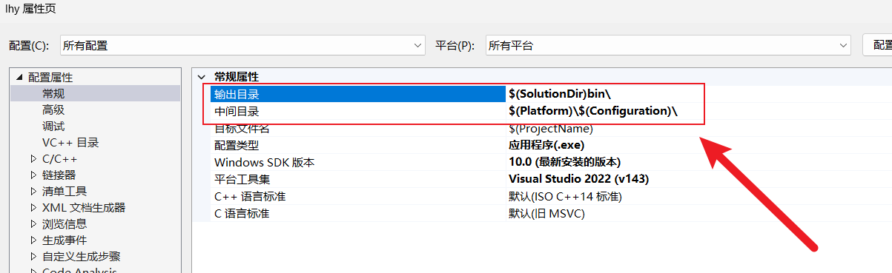
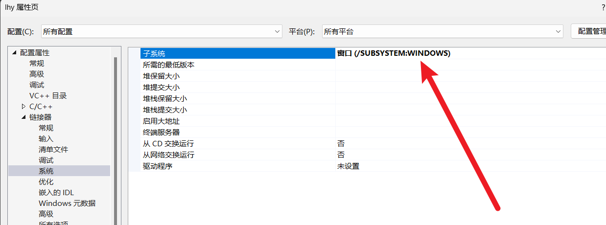
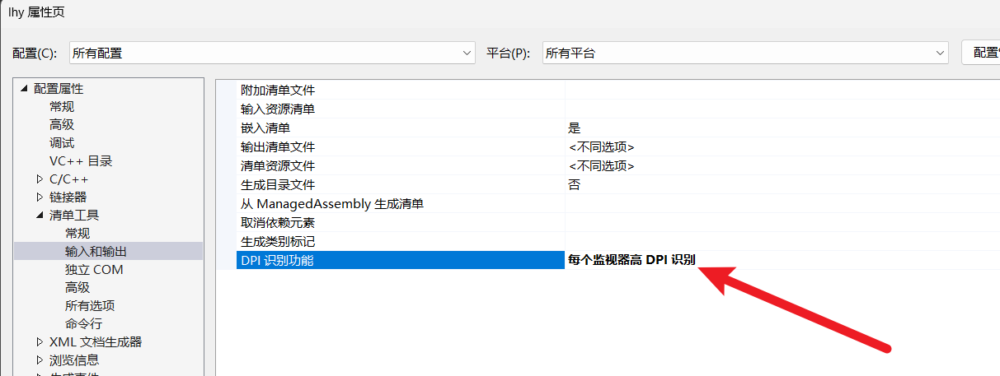
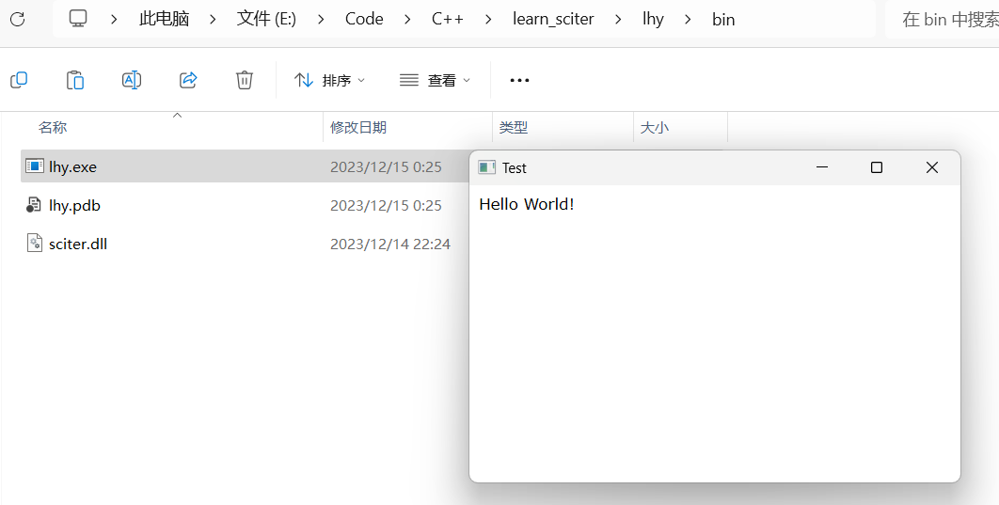

## Sciter教程系列-00 创建最小工程

### 第一步：下载`SciterSDK`
到官网[https://sciter.com/download/](https://sciter.com/download/)下载页面下载SDK压缩包到本地，这里选择`Sciter.TIS`开发包。



解压SDK到磁盘并设置好环境变量，如下图所示。



### 第二步：创建项目
使用VS创建空项目，创建一个单项目的解决方案，如下图所示。



将SciterSDK路径下的`include/sciter-win-main.cpp`拷贝到项目文件夹下的`src`文件夹下，VS中创建筛选器`src`并添加该文件。如下图所示。



### 第三步：配置项目属性
可以看到，第二步添加文件之后，文件中的包含语句是报错的，这是因为项目还没有正确设置附加包含目录。

单击项目，右键选择属性，在属性页中的`C/C++--常规--附加包含目录`中填入`$(ENV_SciterSDK)\include\`，点击确认保存。注意属性页上方选择所有配置所有平台。如果包含语句仍旧报错，尝试重启VS。



在属性页的`常规--输出目录`中填入`$(SolutionDir)bin\`，这个配置将使得编译产生的项目`.exe`文件存储在项目路径下的`bin`文件夹中。



在属性页的`链接器--系统--子系统`中选择`窗口`。



在属性页的`清单工具--输入和输出-DPI识别功能`中选择`每个监视器高DPI识别`。



### 第四步：编写Demo程序
在`src`下创建`HelloWorld.cpp`文件，并添加到VS中。该文件内容如下所示。

```cpp
// HelloWorld.cpp : Defines the entry point for the application.
//

//#include "stdafx.h"
//#include "HelloWorld.h"

#include "sciter-x-window.hpp"

class frame : public sciter::window {
public:
	frame() : window(SW_TITLEBAR | SW_RESIZEABLE | SW_CONTROLS | SW_MAIN | SW_ENABLE_DEBUG) {}
};

#include "resources.cpp"

int uimain(std::function<int()> run) {

	//sciter::debug_output_console console; - uncomment it if you will need console window

	sciter::archive::instance().open(aux::elements_of(resources)); // bind resources[] (defined in "resources.cpp") with the archive

	frame* pwin = new frame();

	// note: this:://app URL is dedicated to the sciter::archive content associated with the application
	pwin->load(WSTR("this://app/main.htm"));

	pwin->expand();

	return run();
}
```

在解决方案路径下（即解决方案`.sln`文件所在的路径）创建`res`文件夹，用来存放`HTML/CSS/图片/脚本`等前端资源文件。

在`res`文件夹创建`main.htm`文件，该文件内容如下所示。

```htm
<html>
    <head>
        <title>Test</title>
        <style></style>
        <script type="text/tiscript"></script>
    </head>
    <body>
        Hello World!
    </body>
</html>
```

### 第五步：创建打包脚本
在解决方案路径下创建一个打包脚本文件`pack-resources.bat`。文件中的内容如下所示。

```bat
@echo off

::获取SciterSDK路径
set SciterSDK=%ENV_SciterSDK%

::获取打包程序packfolder.exe路径
set PackFolderEXE="%SciterSDK%\bin.win\packfolder.exe"

::获取资源文件夹路径
set ResPath="./res"

::调用打包程序
%PackFolderEXE% %ResPath% resources.cpp -v "resources"

pause
```

双击执行该文件，将在解决方案路径下生成`resources.cpp`文件，该文件是打包资源文件夹`res`得到的二进制文件。每次修改资源文件夹之后，都需要运行该打包脚本。也可以将这一步设置到VS的编译生成步骤中。

现在，将`$(SolutionDir);`追加到项目属性页中的`C/C++--常规--附加包含目录`中，以便编译器能够识别解决方案路径下的`resources.cpp`文件。

### 第六步：编译生成可执行文件
在VS中按下快捷键`Ctrl+Shift+B`或者单击菜单`生成--生成解决方案`。如果正确配置，此时生成成功，在`bin`目录中将生成`解决方案名字.exe`文件，但是双击此文件并不能运行，因为还缺少`Scirter`的`.dll`文件。

将`SciterSDK`路径下的`bin.win/x64/sciter.dll`拷贝到解决方案路径下的`bin`文件夹中，再运行生成的可执行文件，即可看到一个窗口，窗口中的文本正是`main.htm`中描述的`Hello World!`。如下图所示。



当然，也可以在VS中单击调试运行，也能看到此窗口。