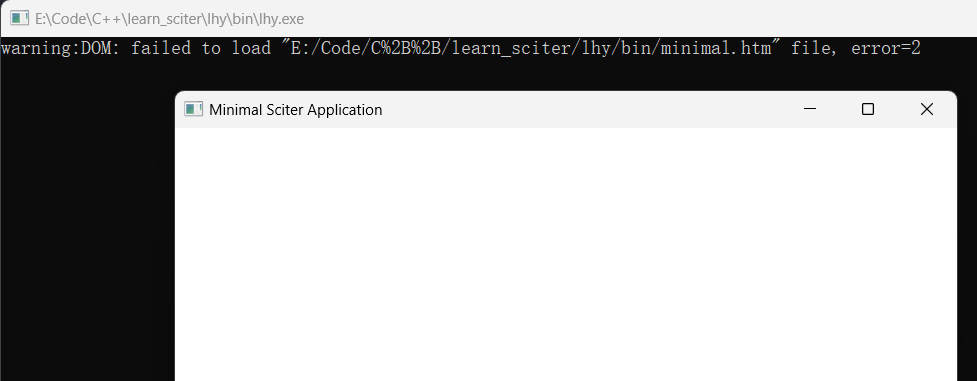

## Sciter教程系列-01 分析sdk/demos/minimal例程

### 编译demos/minimal例程

上一个教程已经搭建好工程运行起来了，现在将VS项目中`src`目录下的源码文件移除（不是删除），然后将`$(SciterSDK)/demos/minimal/minimal.cpp`拷贝到`src/`并添加到VS工程中。编译运行，将会得到如下结果。



控制台提示无法加载`bin/minimal.htm`文件，显然代码中指定了加载此文件，但是本地磁盘没有该文件。为了显示本地文件，将`res/main.htm`拷贝到`bin/`目录下，将代码中的`minimal.htm`改为`main.htm`，再次编译运行即可看到本地的文件被加载成功并显示出来。

接下来分析`minimal.cpp`中的代码。

### 程序入口`WinMain`

代码使用`win32-api`创建了一个窗口并加载本地`.htm`资源文件，有关程序入口`WinMain`的描述见[WinMain function](https://learn.microsoft.com/en-us/windows/win32/api/winbase/nf-winbase-winmain)。

在这个程序入口函数里，主要完成两件事，通过`sciter`加载文件、创建窗口并建立消息循环。

1、`sciter`加载文件。`sciter`可以通过回调函数使得用户可以自定义文件加载的方式。如下代码中，函数`SciterCallback`实现中分发了系列回调事件，其中就包括了加载文件的回调函数，当`SciterLoadFile`加载文件时，执行的其实是自定义的加载文件回调函数`DoLoadData`。而在`DoLoadData`中，将根据指定的资源文件路径的字符串格式来区分资源从内存导入、从`res/`导入、从`resources.cpp`导入或者是从绝对路径导入。

```cpp
::SciterSetCallback(wnd,&SciterCallback,NULL);
::SciterLoadFile(wnd, GetAbsolutePath());
```

示例中使用了指定绝对路径导入资源文件的方式。

2、创建窗口并建立消息循环。这里使用的都是`win32-api`，具体函数用法可参考[Programming reference for the Win32 API](https://learn.microsoft.com/en-us/windows/win32/api/)。创建窗口消息循环相关可参考[Creating a Message Loop](https://learn.microsoft.com/en-us/windows/win32/winmsg/using-messages-and-message-queues#creating-a-message-loop)。

```cpp
HWND wnd = ::CreateWindowEx(
		0, /*WS_EX_LAYOUTRTL,*/
		::SciterClassName(),
		L"Minimal Sciter Application",
		WS_OVERLAPPEDWINDOW,
		CW_USEDEFAULT, 0,
		800, 600,
		0,0,0,0);

::ShowWindow(wnd, SW_SHOWNORMAL);

MSG msg;
while( ::IsWindow(wnd) && GetMessage(&msg, 0, 0, 0) )
{
    TranslateMessage(&msg);
    DispatchMessage(&msg);
}
```

### 资源文件改为从`resources.cpp`加载

按照上一个教程中资源文件路径指定的方式，修改`main.htm`的路径。编译运行，发现窗口正确显示了，但是资源文件未加载。

```cpp
// ::SciterLoadFile(wnd, GetAbsolutePath());
::SciterLoadFile(wnd, WSTR("this://app/main.htm"));
```

调试发现，在`DoLoadData`中，分支代码的`::SciterDataReady`并未被执行，具体来说，是`sciter::archive::instance().get()`方法没有取到所需的资源数据。对比上一个教程的代码可以看到，其中有加载`resources.cpp`数据的动作，而`resources.cpp`又是使用打包脚本打包资源文件得到的，加上以下两行代码，再编译运行，可以看到资源文件成功加载。

```cpp
#include "resources.cpp"
sciter::archive::instance().open(aux::elements_of(resources));
```

### 修改后的`minimal.cpp`

```cpp
// minimal.cpp : minimal Sciter application.

#include <windows.h>

#include "sciter-x.h"

#include "resources.cpp"

HINSTANCE ghInstance = 0;

// generate BGRA image
// check http://sciter.com/forums/topic/how-to-render-memory-image-in-sciter-page/
void GenerateBGRATestsImage(HWND hSciter) {
  BYTE packedData[4 + 4 + 4 + 10 * 10 * 4]; 
  memset(packedData,0,sizeof(packedData));

  // signature
  packedData[0] = 'B';
	packedData[1] = 'G';
	packedData[2] = 'R';
  packedData[3] = 'A';

  // width/height
  packedData[7] = 10;
  packedData[11] = 10;

  // image data
  for ( int i = 0; i < 10 * 10 * 4; i += 4)
  {
			packedData[4 + 4 + 4 + i] = i / 4;
      packedData[4 + 4 + 4 + i + 1] = 255 - i / 4;
      packedData[4 + 4 + 4 + i + 2] = 255;
      packedData[4 + 4 + 4 + i + 3] = 255;
  }
  ::SciterDataReady( hSciter, WSTR("in-memory:test"), packedData,  sizeof(packedData));
}

// handle SC_LOAD_DATA requests - get data from resources of this application
UINT DoLoadData(LPSCN_LOAD_DATA pnmld)
{
  LPCBYTE pb = 0; UINT cb = 0;
  aux::wchars wu = aux::chars_of(pnmld->uri);

  if(wu == const_wchars("in-memory:test"))
  {
    // 从内存加载
    GenerateBGRATestsImage(pnmld->hwnd);
  }
  else if(wu.like(WSTR("res:*")))
  {
    // then by calling possibly overloaded load_resource_data method
    if(sciter::load_resource_data(ghInstance,wu.start+4, pb, cb))
      ::SciterDataReady( pnmld->hwnd, pnmld->uri, pb,  cb);
  } else if(wu.like(WSTR("this://app/*"))) {
    // try to get them from archive (if any, you need to call sciter::archive::open() first)
    aux::bytes adata = sciter::archive::instance().get(wu.start+11);
    if(adata.length)
      ::SciterDataReady( pnmld->hwnd, pnmld->uri, adata.start, adata.length);
  }
  return LOAD_OK;
}

// fulfill SC_ATTACH_BEHAVIOR request 
UINT DoAttachBehavior( LPSCN_ATTACH_BEHAVIOR lpab )
{
  sciter::event_handler *pb = sciter::behavior_factory::create(lpab->behaviorName, lpab->element);
  if(pb)
  {
    lpab->elementTag  = pb;
    lpab->elementProc = sciter::event_handler::element_proc;
    return TRUE;
  }
  return FALSE;
}

// 窗口回调函数
UINT SC_CALLBACK SciterCallback( LPSCITER_CALLBACK_NOTIFICATION pns, LPVOID callbackParam )
{
  // here are all notifiactions
  // 根据回调码执行实际的回调函数。其实就是一个事件响应
  switch(pns->code) 
  {
    // 响应加载文件
    case SC_LOAD_DATA:          return DoLoadData((LPSCN_LOAD_DATA) pns);

    // 响应行为挂载
    case SC_ATTACH_BEHAVIOR:    return DoAttachBehavior((LPSCN_ATTACH_BEHAVIOR)pns );
  }
  return 0;
}

LPCWSTR GetAbsolutePath() {
  static WCHAR url[MAX_PATH] = {0};
  GetModuleFileName(NULL,url,MAX_PATH);// 获取exe可执行文件的绝对路径，其实就是bin/这个路径
  WCHAR* t = wcsrchr(url,'\\');// 找到最后一个反斜杠的位置
  assert(t);

  // 把反斜杠连同后边的exe名清零
  while (*t)
  {
    *t = 0;
    ++t;
  }

  // 继续找上一个反斜杠，这样就找到了父级目录lhy，再定位到res/main.htm
  t = wcsrchr(url,'\\');// 找到最后一个反斜杠的位置
  assert(t);
  wcscpy(t + 1, L"res\\main.htm");

  // wcscpy(t + 1,L"main.htm");// 将路径中的xxx.exe替换成main.htm，定位到目标htm。这种方式要把main.htm拷贝到bin目录中
  return url;
}

// CALLBACK-调用约定，回调函数，系统负责调用，具体由用户实现
// 具体参考：https://blog.csdn.net/yaked/article/details/52354921
int CALLBACK WinMain(HINSTANCE hInstance,
                     HINSTANCE hPrevInstance,
                     LPSTR     lpCmdLine,
                     int       nCmdShow)
{
  ghInstance = hInstance;// 保存实例id到全局实例
  OleInitialize(NULL); // for shell interaction: drag-n-drop, etc.


  // Enable these features, to be available from script 
  // SciterSetOption(NULL, SCITER_SET_SCRIPT_RUNTIME_FEATURES, 
  //  ALLOW_FILE_IO |
  //  ALLOW_SOCKET_IO |
  //  ALLOW_EVAL |
  //  ALLOW_SYSINFO);

  // enabling interaction with inspector:
  ::SciterSetOption(NULL, SCITER_SET_DEBUG_MODE, TRUE);

  // or un-comment the following to see console output: 

  sciter::debug_output_console _;
  
  // windows api 创建窗口，返回创建窗口的句柄
  // HWND - Handle of Window
	HWND wnd = ::CreateWindowEx(
		0, /*WS_EX_LAYOUTRTL,*/
		::SciterClassName(),
		L"Minimal Sciter Application",
		WS_OVERLAPPEDWINDOW,
		CW_USEDEFAULT, 0,
		800, 600,
		0,0,0,0);

  // 设置回调函数
  ::SciterSetCallback(wnd,&SciterCallback,NULL);
  
  // 加载htm文件，也可以指定特定路径
	// ::SciterLoadFile(wnd, GetAbsolutePath());

  // 包含进来的resources.cpp是运行打包脚本生成，里边有个resources数组，这里将数组内容读到sciter::archive的单一实例对象中
  sciter::archive::instance().open(aux::elements_of(resources)); // bind resources[] (defined in "resources.cpp") with the archive
  // note: this:://app URL is dedicated to the sciter::archive content associated with the application
  // 以这种形式加载，会从sciter::archive中读到的资源文件加载
  ::SciterLoadFile(wnd, WSTR("this://app/main.htm"));

  //const char* css = "html {background:red}";
  //::SciterSetCSS(wnd, (LPCBYTE)css, strlen(css), L"about:blank", L"");

	::ShowWindow(wnd, SW_SHOWNORMAL);
  //::SciterLoadFile(wnd, GetUrl());

/*  sciter::value undefined, map = sciter::value::from_string(aux::chars_of(L"{'0': 0, '1': 1, '2': 2, '3': 3}"), CVT_JSON_LITERAL);
  map.set_item(L"1", undefined);
  map.set_item(L"3", undefined);
  sciter::string s = map.to_string(CVT_JSON_LITERAL);
  s = s; */

  // 消息循环
	MSG msg;
  while( ::IsWindow(wnd) && GetMessage(&msg, 0, 0, 0) )
	{
		TranslateMessage(&msg);
		DispatchMessage(&msg);
	}

  return 0;
}
```