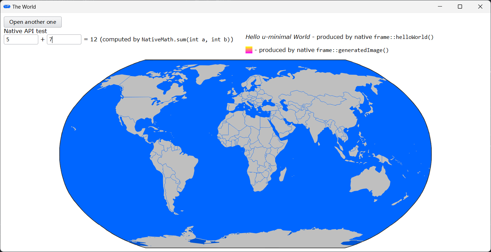

## Sciter教程系列-02 分析sdk/demos/uminimal例程

>上一个教程中建立窗口的代码在不同操作系统中并不通用，`uminimal`例程窗口实现中并不包含特定于操作系统的代码，适用于Windows/MacOS/Linux系统中的应用，并且该例程展示了脚本如何调用本地（C++）代码。

### 编译demos/uminimal例程

将文件`sdk/demos/uminimal/uminimal.cpp`和`sdk/include/sciter-win-main.cpp`拷贝到解决方案下的`src/`文件夹，在VS中移除筛选器`src`下的所有文件，然后添加这两个文件。拷贝`sdk/demos/uminimal/res/`文件夹，覆盖解决方案下的`res`文件夹。运行打包脚本，在VS中编译C++代码并运行，结果如下图所示。



注意，本文所使用的系统是Windows，所以拷贝的是`sciter-win-main.cpp`，对应的MacOS应拷贝`sciter-osx-main.mm`，Linux应拷贝`sciter-gtk-main.cpp`（只在Windows系统下验证过）。

### 分析C++代码

先看看窗口构建的流程。在`uminimal.cpp`中，定义了一个`frame`类，继承自父类`sciter::window`，父类中关于窗口创建、窗口最小化/最大化/关闭、消息代理/响应函数以及构造函数均在`sciter-win-main.cpp`中实现，同时，该文件还实现了入口函数`wWinMain`，在入口函数中，将消息循环以函数对象形式传递给`uimain`函数，该函数实现在`uminimal.cpp`中。在`uimain`函数中，实例化了一个`frame`对象，调用了资源文件加载以及窗口显示方法，最终将上图所示窗口显示出来。

除了窗口构建流程和`minimal`例程有差异，本例程还出现了`SOM_PASSPORT_BEGIN/SOM_PASSPORT_END`这个新的宏，这是用于暴露C++函数给脚本代码调用的。

### SOM(Sciter Object Model)

Sciter对象模型，主要用于在以下三个方面通过本地代码（C++代码）扩展Sciter。
- 脚本访问本地代码的命名空间、方法以及类。
- 自定义的Sciter窗口。
- 自定义本地DOM元素。

#### 1、脚本访问本地代码的命名空间、方法以及类

为了达到脚本访问本地代码的对象或命名空间，需要做以下两件事：
- 在本地代码中定义继承自`sciter::om::asset<T>`的类。这是为了使得对象可以进行引用计数，保证脚本在引用该对象时对象不会被释放。
- 在宏定义`SOM_PASSPORT_BEGIN/END`中通过`SOM_FUNCS`将方法或者属性暴露给脚本，使得脚本可以调用这些暴露的本地方法。

`uminimal`例程中的`NativeMath`类定义如下。
```cpp
struct NativeMath : public sciter::om::asset<NativeMath> {
  int sum(int a, int b) { return a + b; };
  int sub(int a, int b) { return a - b; };

  SOM_PASSPORT_BEGIN(NativeMath)
    SOM_FUNCS( SOM_FUNC(sum), SOM_FUNC(sub))
  SOM_PASSPORT_END
};
```

`NativeMath`将其两个成员函数暴露给脚本，为了能够使脚本能够像访问全局对象一样访问`NativeMath`，需要执行以下调用：
```cpp
SciterSetGlobalAsset(new NativeMath());
```
之后在脚本中就可以执行以下调用：
```cpp
var res = NativeMath.sum(1, 2);
```

#### 2、自定义的Sciter窗口

窗口类的方法也可以暴露给脚本访问，只需要做到以下两点：
- 类继承自`sciter::event_handler`。该父类继承了`sciter::om::asset<event_handler>`，满足引用计数要求。
- 将需要暴露的方法放在`SOM_PASSPORT_BEGIN/END`之间。

例程中的`frame`类继承自`sciter::window`，其父类又继承自`sciter::event_handler`，满足第一个条件。

该类还将成员函数`helloWorld`和`generatedImage`暴露给脚本了，于是脚本中可以像以下代码调用这两个方法。
```cpp
view.frame.helloWorld();
view.frame.generatedImage();
```

#### 3、自定义本地DOM元素

后续涉及**tabs behavior**再分析此种情况。

#### 4、`SOM_PASSPORT`语句块的介绍

该语句块应该出现在类定义体内，开始于`SOM_PASSPORT_BEGIN[_EX]`，结束于`SOM_PASSPORT_END`。开始语句块存在两种形式：
- **SOM_PASSPORT_BEGIN(className)**，其中**className**即是C++中的类名，也是脚本中使用的对象名。
- **SOM_PASSPORT_BEGIN_EX(className,scriptName)**，如果想在脚本中使用别的对象名，应该采用这种形式，由**scriptName**指定C++类**className**在脚本中对应的名字。

在开始语句块与结束语句块之间，还支持以下的宏：
- `SOM_FUNCS(functions definition list)`。括号内的函数列表是用逗号分隔的宏，这些宏可以是**SOM_FUNC(name)**或者**SOM_FUNC_EX(name, scriptName)**，后者用于本地/脚本不同类名的情况。
- `SOM_PROPS(properties definition list)`。括号内的属性列表是用逗号分隔的宏，这些宏可以是以下列出宏的组合：
  - **SOM_PROP(fieldName)**。基于成员变量**fieldName**定义的读写属性。
  - **SOM_RO_PROP(fieldName)**。基于成员变量**fieldName**定义的只读（RO-ReadOnly）属性。
  - **SOM_VIRTUAL_PROP(scriptName, getterFuncName, setterFuncName)**。通过提供`getter/setter`方法定义的虚拟属性。
  - **SOM_RO_VIRTUAL_PROP(scriptName, getterFuncName)**。通过提供的`getter`方法定义只读的虚拟属性。
  - **SOM_ITEM_GET(funcName)**。当脚本执行形如`var item = nativeObj[key];`的代码时，运算符`[]`需要本地执行名为**funcName**的按索引读值函数提供支持。本地函数形式为`bool funcName(keyType key_or_index, valType& outVal)`。
  - **SOM_ITEM_SET(funcName)**。当脚本执行形如`nativeObj[key] = val;`的代码时，运算符`[]`需要本地执行名为**funcName**的按索引写值函数提供支持。本地函数形式为`bool funcName(keyType key_or_index, valType outVal)`。
  - **SOM_ITEM_NEXT(funcName)**。当脚本执行形如`for(var item in nativeObj)`的遍历过程时，需要本地执行名为**funcName**的迭代器函数提供支持。本地函数形式为`bool funcName(sciter::value& index, valType& val)`。

以下列出的C++类型可以直接转换到对应的脚本类型。
- `bool` – 对应到脚本中的**true/false**。
- `int` – 对应到脚本中的**int**（只支持**int32**）。
- `float/double` – 对应到脚本中的**float**。
- `sciter::string` – 对应到脚本中的**string**。
- `std::string` – 对应到脚本中的**symbol**。
- `std::vector<T>` – 对应到脚本中的**array**，**T**也要转换成脚本中的对应类型。
- `sciter::value` – 对应到脚本中的**union**类型，可以包含上述列出的类型、**undefined**值、键值对map以及本地类型**asset**的引用。

### 分析TIS代码

在**Sciter**中前端的响应处理使用的是**tiscript**脚本语言。有关该语言可以克隆[https://github.com/gxlmyacc/sciter-doc-zh](https://github.com/gxlmyacc/sciter-doc-zh)仓库进行查阅，该仓库是sciter的中文帮助手册，运行其中的**Help.exe**可以阅读帮助手册。

首先看`self.ready`事件。该事件在文档加载的最后一步生成，在事件响应函数中，调用了C++中注册（暴露）的函数。这里的`view`代表当前执行脚本所在的窗口，`frame`则是在执行`SOM_PASSPORT_BEGIN(frame)`是注册的类名，此类名可在脚本中像全局对象一样使用，通过该对象，可调用注册的两个成员函数**helloWorld**和**generatedImage**。在`event change`事件中调用`NativeMath`的方法也是同理。

```javascript
function self.ready() {
  // accessing native helloWorld() method defined in C++ class frame: 
  $(#message).text = view.frame.helloWorld();
  $(img#native).value = view.frame.generatedImage();
}
```

再看看`event click`事件中，通过**view.window**创建了一个窗口，这是**view**的一个成员函数，用于创建单独的窗口，该方法接受一个参数**params**，**params**是一个对象，它可以包含以下字段：
- `type` - **int**类型，窗口类型，**View.FRAME_WINDOW**、**View.TOOL_WINDOW**、**View.POPUP_WINDOW**中之一。
- `url` - **string**类型，加载到该窗口的文档的路径。
- `state` - **int**类型，窗口的初始状态，**View.WINDOW_SHOWN**、**View.WINDOW_HIDDEN**、**View.WINDOW_MINIMIZED**、**View.WINDOW_MAXIMIZED**、**View.WINDOW_FULL_SCREEN**其中之一。
- `parameters` - **对象**类型，传递的参数，它会放到新创建窗口的`view.parameters`变量中。
- `caption` - **string**类型，窗口标题。
- `alignment` - **int**类型，窗口相对于屏幕的位置，1 到 9，相对于父窗口。
- `screen` - **int**类型，0 到 `View.screens` - 1，如果`alignment`是1到9，则该字段决定该窗口显示在哪个屏幕/监视器。可选参数。

详细信息可查阅**sdk/doc/content/sciter/View.htm**，该文档介绍了视图（View）对象的成员变量和成员函数等。

### 总结

通过`uminimal`这个例程，分析了通用的创建窗口加载资源文件、C++本地代码注册到脚本、脚本调用本地C++代码的整个流程。