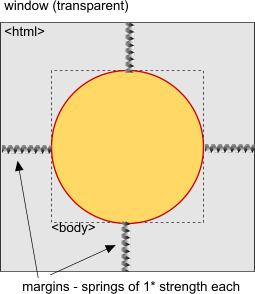

## Sciter教程系列-03 分析sdk/demos/ulayered例程

>本例程用分层窗口的方式渲染了一个挂钟，分层窗口（[Layered Windows](https://learn.microsoft.com/en-us/windows/win32/winmsg/window-features#layered-windows)）简单说就是支持透明度的窗口。分层窗口可以实现任意形状的窗口，例程中将涉及`BEGIN_FUNCTION_MAP/END_FUNCTION_MAP`注册C++函数、元素行为、弹性布局、自定义UI等方面的内容。

### 编译demos/ulayered例程

将文件`sdk/demos/ulayered/ulayered.cpp`和`sdk/include/sciter-win-main.cpp`拷贝到解决方案下的`src/`文件夹，在VS中移除筛选器`src`下的所有文件，然后添加这两个文件。拷贝`sdk/demos/ulayered/res/`文件夹，覆盖解决方案下的`res`文件夹。

如下图所示，更改项目的部分配置。首先在属性页的"常规--输出目录/中键目录"将值分别改为"$(SolutionDir)bin\"和"$(SolutionDir)obj\"，前者将生成的执行文件输出到解决方案下的bin目录，后者将生成过程的中间文件输出到obj目录，方便管理生成的文件，当然，这里只是说明可以这么改。然后单击属性页的配置管理器，将活动解决方案中配置和平台的Debug/Win32删除，也就是只留下Release/x64这一组配置，同样，将项目中的其他配置/平台也删除，接着将`sdk/bin.win/x64/sciter.dll`拷贝到解决方案下的bin目录。**注意：如果VS中解决方案平台的位数和sciter.dll的位数对不上，运行会报错返回0xFFFFFFFF。**


运行打包脚本，在VS中编译C++代码并运行，结果如下图所示。


### 分析C++代码

在frame类的实现中，指定了窗口启用Alpha通道以及毛玻璃效果，同时将成员函数注册到脚本。

#### 宏定义**BEGIN/END_FUNCTION_MAP**

这对宏定义标示需要注册到脚本的成员函数，宏定义**FUNCTION_0**的含义是将参数数量为0的成员函数**architecture**注册到脚本，在脚本中可以通过`view.architecture();`语句调用到C++中该成员函数。

```cpp
frame() : window( SW_MAIN | SW_ENABLE_DEBUG | SW_ALPHA | SW_GLASSY, wrc) {}

BEGIN_FUNCTION_MAP
  FUNCTION_0("architecture", architecture);
END_FUNCTION_MAP
```

类frame间接继承于类event_handler_raw，此父类具有虚函数**on_script_call**，当TIScript脚本通过`view.func()`调用C++函数时，会调用函数**on_script_call**进行命令的分发。而上述将C++函数注册到脚本的宏展开之后其实就是在子类frame中重写了虚函数，函数体不同的分支构成注册函数查询表，脚本调用C++函数时**on_script_call**通过这个查询表就可以调用对应的注册函数。

### 分析HTML/CSS代码

关于html标签这里有几个要注意的写法。
- `#name`，相当于<tag id="name" />；
- `.name`，相当于<tag class="name" />；
- `|name`，相当于<tag type="name" />；
- `(somename)`，相当于<tag name="somename" />。

样式表中有两点需要关注。
- `prototype: Clock url(analog-clock.tis);`。表示body这个元素要继承自Clock类，该类定义在analog-clock.tis中。Clock类组件，也叫做行为，包含绘制挂钟的脚本代码，通过prototype的将行为绑定到元素上，这些元素将会按照行为的规则去显示；
- `margin:*;`。这为元素定义了可变的外边距，就像是在元素的四周放置了四个弹簧一样，弹簧的存在将元素固定在所在容器的中心。如下图所示。

  

### 分析TIS代码

sciter使用的脚本是TIScript，要读懂这种脚本代码，需要借助官方的帮助文档，这里使用中文手册进行演示，关于中文手册，见系列教程02。

#### 1.内联脚本

在html文件中`<script type="text/tiscript">...</script>`之间的脚本为内联脚本。

```javascript
const body = $(body);

self.ready = function() // html loaded - DOM ready
{
    view.caption = "Sciter Clock";

    // positioning the window in the middle of the screen:
    var (sx,sy,sw,sh) = view.screenBox(#workarea,#rectw); // gettting screen/monitor size
    var (w,h) = self.$(body).box(#dimension); 
    w += w/2; h += h/2; // to accomodate expanding animation
    
    view.move( sx + (sw - w) / 2, sy + (sh - h) / 2, w, h);

    body.timer(40ms, function() { body.attributes.addClass("shown") });
    $(span#platform).text = System.PLATFORM;
    $(span#arch).text = view.architecture(); // calling native function defined in ulayered.cpp
}
```

上述脚本代码出现的一些语法以及方法说明如下。
- `$(body)`，取到**<body></body>**这个元素，类似的还有`$(span#platform).text`，含义为取到id为platform的span元素的text文本；
- `self.ready`，html元素的事件，文档加载的最后一步生成该事件；
- `view.caption`，view对象的属性，view是当前运行脚本的视图对象；
- `view.screenBox()`，view对象的方法；
- `body.timer()`，元素对象的方法；

这里以view对象举例，介绍在帮助文档中定位属性或者方法的流程。如下图所示，打开帮助文档，在左侧选项卡中打开**Sciter DOM类**，定位到其下的视图对象，在右侧的方法列表中找到**screenBox**方法，中间的视图即定位到该方法的详细描述。同样，也能找到**caption**属性的描述，不过文档里叫做**windowCaption**，实测二者没区别。另外视图对象用**view/View**貌似也没区别。


关于按钮等页面元素事件响应，写法如下。

```javascript
event click $(#close)
{
    body.timer(600ms, () => view.close() );
    body.attributes.removeClass("shown");
}
```

这种写法叫做符号事件名称，通过`event "name" (evt) {}`来使用，name就是对应的符号事件名称，click这个符号事件是按钮和超链接点击。更多的符号事件名称可查看帮助手册**Sciter DOM类**中事件对象下的符号事件名称。

#### 2.外联脚本

通过```<script type="text/tiscript">include "xxx.tis";</script>```或者`url(xxx.tis)`的方式指定的位于其他文件内的脚本叫做外联脚本。

```javascript
class Clock: Behavior 
{
  function attached() { 
    this.paintForeground = this.drawclock; // attaching draw handler to paintForeground layer
    this.timer(300,::this.refresh());
    
    this.borderWidth = this.style["border-width"] || 3;
    this.borderColor = this.style["border-color"] || color("brown");
  }

  function drawclock(gfx)
  {
  }
}
```

上述脚本代码展示了利用行为（Behavior）类扩展DOM元素的一种自定义UI组件的方式，这个类可以定义新的属性、方法和事件处理器，通过使用CSS中的prototype属性或者在代码中手动修改已存在DOM元素的prototype属性将该行为绑定到DOM元素。

```css
selector {
    prototype: ClassName url(file.tis);
    /* ... 其他CSS属性 */
}
```

以下代码是声明式行为赋值。
- selector是一个有效的CSS选择器；
- ClassName是脚本类的名称；
- url(file.tis)是包含该脚本类的脚本文件的url。如果脚本类是定义在文档本身的script节中的话，这个字段是可省略的。

Behavior是一个从Element类或其他行为类派生的类。下面是一个行为类的模板：

```javascript
class MyWidget : Element
{
   // 实例变量, 每个元素将拥有这些变量的一份副本。
   this var foo = "foo";
   ...
   // 类变量, 所有实例共享这个类的这些变量
   var bar = "bar";
   ...

   // 生命周期方法:

   // behavior的"constructor", 当元素获取到该类时被调用
   function attached() { /* this 指代该元素 */ }

   // behavior的"destructor", 当元素失去该类时被调用
   function detached() { /* this指代该元素 */ }

   // 虚拟(virtual)属性
   property baz(v) { ... }
   // 和方法
   function boo() { ... }

   // 事件处理器:
   
   // 点击事件
   event click (evt, that) { /* 注意: this指代生成click事件的元素
                                that为订阅元素 - 一个MyWidget类的实例 */ }

   // 在 <a class="next">元素上的点击事件
   event click $(a.next) (evt, that) { ... /* 注意: this指代a.next元素，即生成click事件的元素 */  }
   ...
}
```

注意，所有的方法、事件处理器和属性在运行期被调用时，this变量被设置为该行为类绑定的元素实例上。

在例程中，analog-clock.tis通过body.paintForeground属性调用了行为类的自定义绘制函数，该函数是一个参数为gfx对象（全局对象）的脚本函数，通过该对象可以实现图像、文本的绘制。有关绘图对象的信息可查看帮助手册**Sciter DOM类**中绘图对象。

### 总结

通过`layered`这个例程，分析了C++注册函数到脚本的原理，演示了如何通过帮助手册定位信息，这给理解脚本代码提供了一个可行的方法。